# Big Data Real-Time Fraud Detection System

A production-grade, real-time event-driven fraud detection pipeline designed for high-throughput financial transactions. The system leverages **Apache Kafka** for data streaming, **PySpark (Structured Streaming)** for real-time processing and machine learning inference, **Redis** for sub-millisecond blacklist checks, **PostgreSQL** for transactional storage, **Delta Lake (MinIO)** for ACID-compliant analytical storage, **Apache Airflow** for MLOps and storage orchestration, and **Streamlit** for real-time dashboard analytics.

---

## Architecture

Below is the high-level architecture of the Big Data Fraud Detection System, detailing the dual-write streaming path and the automated batch/orchestration path.



### System Flow Details
1. **Data Ingestion & Streaming**: A simulation script (`producer.py`) processes the Paysim dataset (6.3M transactions) and streams it at 100 tx/sec into the Apache Kafka topic `transactions-data`.
2. **Real-time Processing & ML Inference (PySpark)**:
   - **Layer 1: Redis Blacklist Check**: Instantly verifies the sender/receiver against a cached list of blacklisted accounts (<1ms lookup).
   - **Layer 2: Rule Engine**: Applies heuristic rules (e.g., specific transaction types like `TRANSFER`/`CASH_OUT` combined with high drain ratios).
   - **Layer 3: Machine Learning Model**: Uses a trained **Random Forest** classifier to detect fraud probabilities.
3. **Storage Sink (Dual-Write Pattern)**:
   - **PostgreSQL**: Stores real-time transactions for immediate display on the Streamlit dashboard (~10k recent records).
   - **Delta Lake (MinIO Object Storage)**: Acts as the analytical Lakehouse store. Files are stored in `.parquet` format with ACID transaction logs (`_delta_log/`), enabling scalable analytics and **Time Travel** debugging.
4. **Orchestration & MLOps (Apache Airflow)**:
   - **Daily Blacklist Refresh**: Pulls newly identified fraud accounts and updates the Redis cache.
   - **Weekly Model Retrain**: Automatically retrains the Random Forest model on the complete Delta Lake history and logs parameters/metrics (AUC-ROC, F1-score) to **MLflow**.
   - **Daily Delta Compaction**: Runs `OPTIMIZE` and `VACUUM` queries to merge micro-batch parquet files and clean up history older than 7 days.
5. **Security & Manual Ingestion**: A secured **FastAPI** service provides a REST endpoint protected by API keys to inject individual transactions manually.

---

## Key Features

- **Real-Time Event Streaming**: Fault-tolerant streaming with Apache Kafka & Zookeeper.
- **Multilayered Fraud Detection**: Combines Redis blacklisting, rule-based filtering, and machine learning inference (Random Forest) in a unified PySpark Structured Streaming job.
- **Lakehouse Dual-Write**: Implements OLTP storage (PostgreSQL) and OLAP storage (Delta Lake on local S3-compatible MinIO) in parallel.
- **Orchestration**: Fully managed MLOps pipelines (retraining, caching, compaction) scheduled via Apache Airflow.
- **Visual Analytics**: Interactive Streamlit Dashboard showcasing real-time transaction speeds, alerts, search/filters, and aggregate statistics.
- **CI/CD Integration**: Pre-configured GitHub Actions for automated unit testing (security/vulnerabilities) and automated image deployment to `ghcr.io`.

---

## System Requirements

- **Docker** & **Docker Compose**
- **Git**
- **Python 3.10+** (if running local development/setup scripts)

---

## Setup & Installation

### 1. Clone the Repository
```bash
git clone https://github.com/Vantoan252003/BigDataFraudDetection.git
cd BigDataFraudDetection
```

### 2. Add the Dataset (REQUIRED STEP)
Due to GitHub's file size limit (100MB max), the original dataset (`paysim.csv`) is **not included** in this repository.
1. Create a `data/` folder in the project root directory (at the same level as `README.md`).
2. Download the Paysim dataset from Kaggle (or your source) and save it as `paysim.csv` inside the `data/` folder.

### 3. Configure Environment Variables
Copy `.env.example` to `.env` and fill in/configure your values. You can run the following commands to initialize required variables:
```bash
cp .env.example .env

# Generate Airflow Fernet key and write to .env
python3 -c "from cryptography.fernet import Fernet; print('AIRFLOW_FERNET_KEY=' + Fernet.generate_key().decode())" >> .env
```

### 4. Start the Containers
Build and run all Docker services in detached mode:
```bash
docker compose up -d --build
```
*This command launches 13 containers including Zookeeper, Kafka, Kafdrop, PostgreSQL, Redis, MinIO, Streamlit, FastAPI, MLflow, and the Apache Airflow suite (Webserver, Scheduler, Init).*

### 5. Initialize the Database & Train the Initial Model
Once all containers are in the `running` (healthy) state, execute the following Spark jobs to set up the DB schemas and train the baseline model:

**Step A: Load the simulation blacklist into Redis/PostgreSQL**
```bash
docker compose run --rm trainer spark-submit jobs/blacklist_loader.py
```

**Step B: Train the Machine Learning Model (Logs metrics to MLflow)**
```bash
docker compose run --rm trainer spark-submit scripts/train_paysim_model.py
```

---

## Port Matrix & Dashboards

Access the system UIs using the local URLs below:

| Dashboard / Service | Local URL | Default Credentials |
| :--- | :--- | :--- |
| **Streamlit Dashboard** | [http://localhost:8501](http://localhost:8501) | *None* |
| **Apache Airflow UI** | [http://localhost:8080](http://localhost:8080) | `admin` / `admin` |
| **MinIO Console** | [http://localhost:9001](http://localhost:9001) | `minioadmin` / `minioadmin123` |
| **MLflow Tracking Server** | [http://localhost:5050](http://localhost:5050) | *None* |
| **Kafdrop (Kafka Web UI)** | [http://localhost:9000](http://localhost:9000) | *None* |
| **FastAPI Health Endpoints** | [http://localhost:8000/docs](http://localhost:8000/docs) | *None* |

---

## Activating MLOps Pipelines in Airflow

1. Open the [Airflow UI](http://localhost:8080) and log in with credentials `admin / admin`.
2. You will see 3 pre-defined DAGs:
   - `blacklist_daily_refresh`: Refreshes the Redis blacklist.
   - `model_weekly_retrain`: Retrains the model weekly on Delta Lake historical data.
   - `delta_daily_compaction`: Performs daily parquet optimization and log cleanup.
3. Toggle the switch to **Active** (left column) for each DAG to enable automatic scheduling.
4. Click the **Play** button (Trigger DAG) to run any of them manually.

---

## Stopping the System

To cleanly stop the containers and release system memory/CPU resources:
```bash
docker compose down
```
If you wish to remove the stored data volumes as well:
```bash
docker compose down -v
```
